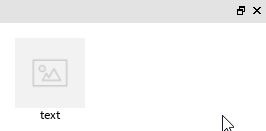
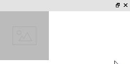
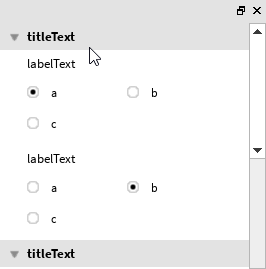

<h1 align="center">Studio Widgets</h1>

<div align="center">
	A set of GUI elements to use in Roblox Plugins hosted in PluginGUIs. Widgets have a standard "Studio" look & feel.
</div>

<div>&nbsp;</div>

## Overview
With PluginGuis, your RobloxPlugins can create GUIs hosted in dockable widgets (as opposed to being hosted in 3d viewport).

We encourage plugin developers to use this library so that your GUIs have a standardized look & feel: colors, spacing, layout, etc.

We will keep these libraries up to date as Studio look & feel changes (e.g. automatic support for Dark Theme, when that happens).

## Please contribute!
We will work hard to keep this library up to date, bug-free, etc.

That said, we have a small team and many competing priorities, so your efforts to improve this library are welcome and invited.  Feel free to fork the repository and make fixes and improvements as you see fit.  We will be happy to merge in any updates that fit within our vision of the library.

## Coding conventions
Class and function names are CamelCase, starting with caps.
Variable and member names are CamelCase, starting with lowercase.
Members and methods of classes that begin with '_' are considered "private": should not be read or written outside the class.

### Files

* [CollapsibleTitledSection.lua](#collapsibletitledsectionlua)
* [CustomTextButton.lua](#customtextbuttonlua)
* [GuiUtilities.lua](#customtextbuttonlua)
* [ImageButtonWithText.lua](#imagebuttonwithtextlua)
* [LabeledCheckbox.lua](#labeledcheckboxlua)
* [LabeledMultiChoice.lua](#labeledmultichoicelua)
* [LabeledSlider.lua](#labeledsliderlua)
* [LabeledTextInput.lua](#labeledtextinputlua)
* [RbxGui.lua](#rbxguilua)
* [StatefulImageButton.lua](#statefulimagebuttonlua)
* [VerticallyScalingListFrame.lua](#verticallyscalinglistframelua)
* [VerticalScrollingFrame.lua](#verticalscrollingframelua)

#### CollapsibleTitledSection.lua
A "Section" containing one or more widgets, with titlebar.  Title bar includes rotating arrow widget which can be used to collapse/expand the section.


```Lua
local collapse = CollapsibleTitledSection.new(
	"suffix", -- name suffix of the gui object
	"titleText", -- the text displayed beside the collapsible arrow
	true, -- have the content frame auto-update its size?
	true, -- minimizable?
	false -- minimized by default?
)

-- put things we want to be "collapsed" under the frame returned by the :GetContentsFrame() method
local label = Instance.new("TextLabel")
label.Text = "Peekaboo!"
label.Size = UDim2.new(0, 60, 0, 20)
label.BackgroundTransparency = 1
label.BorderSizePixel = 0
label.Parent = collapse:GetContentsFrame()

-- set the parent of the collapse object by setting the parent of the frame returned by the :GetSectionFrame() method
collapse:GetSectionFrame().Parent = widgetGui
```

#### CustomTextButton.lua
A text button contained in an image (rounded rect).  Button and frame highlight appropriately on hover and click.


```Lua
local button = CustomTextButton.new(
	"button", -- name of the gui object
	"labelText" -- the text displayed on the button
)

-- use the :getButton() method to return the ImageButton gui object
local buttonObject = button:getButton()
buttonObject.Size = UDim2.new(0, 70, 0, 25)

buttonObject.MouseButton1Click:Connect(function()
	print("I was clicked!")
end)

buttonObject.Parent = widgetGui
```

#### GuiUtilities.lua
Grab bag of functions and definitions used by the rest of the code: colors, spacing, etc.

#### ImageButtonWithText.lua
A button comprising an image above text.  Button highlights appropriately on hover and click.


```Lua
local button = ImageButtonWithText.new(
	"imgButton", -- name of the gui object
	1,  -- sets the sorting order for use with a UIGridStyleLayout object
	"rbxassetid://924320031", -- the asset id of the image
	"text", -- button text 
	UDim2.new(0, 100, 0, 100), -- button size
	UDim2.new(0, 70, 0, 70), -- image size
	UDim2.new(0, 15, 0, 15), -- image position
	UDim2.new(0, 60, 0, 20), -- text size
	UDim2.new(0, 20, 0, 80) -- text position
)

-- use the :getButton() method to return an ImageButton gui object
local buttonObject = button:getButton()

buttonObject.MouseButton1Click:Connect(function()
	-- use the :setSelected() method to highlight the button
	-- use the :getSelected() method to return a boolean that defines if the button is selected or not
	button:setSelected(not button:getSelected())
end)

buttonObject.Parent = widgetGui
```

#### LabeledCheckbox.lua
A widget comprising a text label and a checkbox.  Can be configured in normal or "small" sizing.  Layout and spacing change depending on size. 


```Lua
local checkbox = LabeledCheckbox.new(
	"suffix", -- name suffix of gui object
	"labelText", -- text beside the checkbox
	false, -- initial value
	false -- initially disabled?
)

-- get/set current value of the checkbox
checkbox:SetValue(true)
print(checkbox:GetValue())

-- disables and forces a checkbox value
checkbox:DisableWithOverrideValue(false)
if (checkbox:GetDisabled()) then
	checkbox:SetDisabled(false)
end

-- return the label or button frames
print(checkbox:GetLabel())
print(checkbox:GetButton())

-- fire function when checkbox value changes
checkbox:SetValueChangedFunction(function(newValue)
	print(newValue);
end)

-- use :GetFrame() to set the parent of the LabeledCheckbox
checkbox:GetFrame().Parent = widgetGui
```

#### LabeledMultiChoice.lua
A widget comprising a top-level label and a family of radio buttons.  Exactly one radio button is always selected.  Buttons are in a grid layout and will adjust to flood-fill parent. Height updates based on content.


```Lua
-- each choice must have an Id and Text
local choices = {
	{Id = "choice1", Text = "a"},
	{Id = "choice2", Text = "b"},
	{Id = "choice3", Text = "c"}
}

local multiChoice = LabeledMultiChoice.new(
	"suffix", -- name suffix of gui object
	"labelText", -- title text of the multi choice
	choices, -- choices array
	1 -- the starting index of the selection (in this case choice 1)
)

-- get/set selection index
multiChoice:SetSelectedIndex(3) 
print(multiChoice:GetSelectedIndex())

-- fire function when index value changes
multiChoice:SetValueChangedFunction(function(newIndex)
	print(choices[newIndex].Id, choices[newIndex].Text)
end)

-- use :GetFrame() to set the parent of the LabeledMultiChoice
multiChoice:GetFrame().Parent = widgetGui
```

#### LabeledSlider.lua
A widget comprising a label and a slider control.


```Lua
-- note: the slider is clamped between [0, intervals]
local slider = LabeledSlider.new(
	"suffix", -- name suffix of gui object
	"labelText", -- title text of the multi choice
	100, -- how many intervals to split the slider into
	50 -- the starting value of the slider
)

-- get/set values
slider:SetValue(0)
print(slider:GetValue())

-- fire function when slider value changes
slider:SetValueChangedFunction(function(newValue)
	print(newValue)
end)

-- use :GetFrame() to set the parent of the LabeledSlider
slider:GetFrame().Parent = widgetGui
```

#### LabeledTextInput.lua
A widget comprising a label and text edit control.


```Lua
local input = LabeledTextInput.new(
	"suffix", -- name suffix of gui object
	"labelText", -- title text of the multi choice
	"Hello world!" -- default value
)

-- set/get graphemes which is essentially text character limit but grapemes measure things like emojis too
input:SetMaxGraphemes(20)
input:GetMaxGraphemes()

-- set/get values methods
input:SetValue("Hello world again...")
print(input:GetValue())

-- fire function when input value changes
input:SetValueChangedFunction(function(newValue)
	print(newValue)
end)

-- use :GetFrame() to set the parent of the LabeledTextInput
input:GetFrame().Parent = widgetGui
```

#### RbxGui.lua
Helper functions to support the slider control.

#### StatefulImageButton.lua
An image button with "on" and "off" states.



```Lua
local button = StatefulImageButton.new(
	"imgButton", -- name of the gui object
	"rbxassetid://924320031", -- image asset id
	UDim2.new(0, 100, 0, 100) -- size of the button
)

-- set if the StatefulImageButton is selected or not
local selected = false
button:setSelected(selected)

-- use the :getButton() method to return the ImageButton gui object
local buttonObject = button:getButton()
buttonObject.MouseButton1Click:Connect(function()
	selected = not selected
	button:setSelected(selected)
end)
buttonObject.Parent = widgetGui
```

#### VerticallyScalingListFrame.lua
A frame that contains a list of sub-widgets.  Will grow to accomodate size of children.

```Lua
local listFrame = VerticallyScalingListFrame.new(
	"suffix" -- name suffix of gui object
)

local label = Instance.new("TextLabel")
label.Text = "labelText"
label.Size = UDim2.new(0, 60, 0, 20)
label.BackgroundTransparency = 1
label.BorderSizePixel = 0
local label2 = label:Clone()
local label3 = label:Clone()

-- fire function when the listFrame resizes
listFrame:SetCallbackOnResize(function()
	print("Frame was resized!")
end)

-- add a gui element to the VerticallyScalingListFrame
listFrame:AddChild(label)
listFrame:AddChild(label2)
listFrame:AddChild(label3)

-- add padding to the VerticallyScalingListFrame
listFrame:AddBottomPadding()

-- use :GetFrame() to set the parent of the VerticallyScalingListFrame
listFrame:GetFrame().Parent = widgetGui
```

#### VerticalScrollingFrame.lua
A frame that holds sub-widgets and gives the user the ability to scroll through them over a fixed space.



```Lua
local choices = {
	{Id = "choice1", Text = "a"},
	{Id = "choice2", Text = "b"},
	{Id = "choice3", Text = "c"}
}

local scrollFrame = ScrollingFrame.new("suffix")

local listFrame = VerticallyScalingListFrame.new("suffix")
local collapse = CollapsibleTitledSection.new("suffix", "titleText", true, true, true)
local multiChoice = LabeledMultiChoice.new("suffix", "labelText", choices, 1)
local multiChoice2 = LabeledMultiChoice.new("suffix", "labelText", choices, 2)

multiChoice:GetFrame().Parent = collapse:GetContentsFrame()
multiChoice2:GetFrame().Parent = collapse:GetContentsFrame()
listFrame:AddChild(collapse:GetSectionFrame()) -- add child to expanding VerticallyScalingListFrame

local collapse = CollapsibleTitledSection.new("suffix", "titleText", true, false, false)
local multiChoice = LabeledMultiChoice.new("suffix", "labelText", choices, 1)
local multiChoice2 = LabeledMultiChoice.new("suffix", "labelText", choices, 2)

multiChoice:GetFrame().Parent = collapse:GetContentsFrame()
multiChoice2:GetFrame().Parent = collapse:GetContentsFrame()
listFrame:AddChild(collapse:GetSectionFrame()) -- add child to expanding VerticallyScalingListFrame

listFrame:AddBottomPadding() -- add padding to VerticallyScalingListFrame

listFrame:GetFrame().Parent = scrollFrame:GetContentFrame() -- scroll content will be the VerticallyScalingListFrame
scrollFrame:GetSectionFrame().Parent = widgetGui -- set the section parent
```

### Bringing the project into studio
The easiest way to bring the project into studio is to use the [HttpService](https://www.robloxdev.com/api-reference/class/HttpService) to pull the contents directly from this github project into module scripts. After enabling the http service from `Game Settings` the following code can be run in the command bar.

```Lua
local http = game:GetService("HttpService")
local req = http:GetAsync("https://api.github.com/repos/Roblox/StudioWidgets/contents/src")
local json = http:JSONDecode(req)

local targetFolder = Instance.new("Folder")
targetFolder.Name = "StudioWidgets"
targetFolder.Parent = game.Workspace

for i = 1, #json do
	local file = json[i]
	if (file.type == "file") then
		local name = file.name:sub(1, #file.name-4)
		local module = targetFolder:FindFirstChild(name) or Instance.new("ModuleScript")
		module.Name = name
		module.Source = http:GetAsync(file.download_url)
		module.Parent = targetFolder
	end
end
```

## License
Available under the Apache 2.0 license. See [LICENSE](LICENSE) for details.